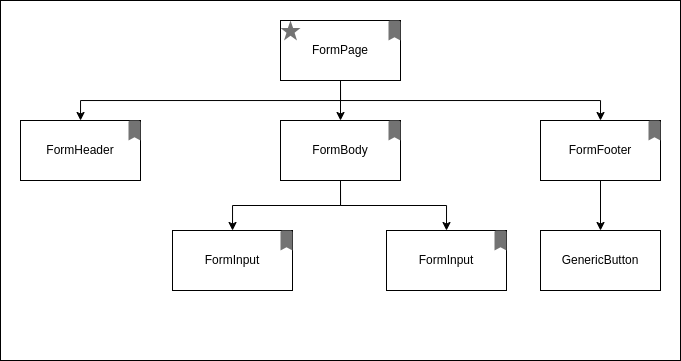

# react-adventures

In this project I want to explore different ways of handling forms in React:
- RHF - using `Zod` and `react-hook-form`,
- Formik - using `yup` and `Formik`,
- Custom - I will try to implement custom form solution. 

### Custom solution

Triggering whole component tree re-evaluation, when only single nested input changes is a deal breaker. This should never happen, and, unfortunately, that's how `Formik` works. 

Goal is to have something similar to Angular's `FormGroup, FormControl and FormArray` and to never trigger Reacts re-evaluation of the whole components tree - only the inputs and when user wants it.
Probably on subscription to change event.

## PoC App

Application consists of:
- `TopBar` with link buttons to each of form versions testes, as well as `ReEvaluationCounter` component, which counts how many components were re-evaluation after user action. 
- Components which have counted re-evaluation are marked with a bookmark icon on the diagram below,
- `FormPage` component for each form type (marked with star) is also the root component, which means triggering re-evaluation in it will also re-evaluate ALL the children if not prevented,
- Each `FormPage` has 2 inputs, one of which is validated, and a button. Inputs and button are in sibling components, which causes us to traverse through parent in order to verify if the form is invalid and button should be disabled.

The idea is to see how many of those components need to re-evaluate, if use inputs some value and triggers validity change, which in turn causes button to change `disable` state.

### Page structure

